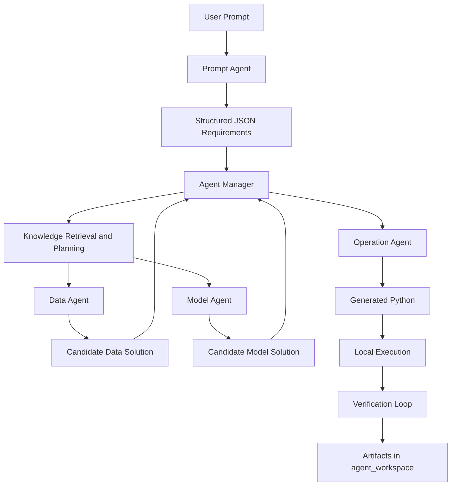

# 02. Architecture And Agents

## 1. System Overview

AutoML-Agent is organized around an orchestration layer plus specialized agents.

## 2. Main Runtime Components

### 2.1 Prompt Agent

The Prompt Agent translates a free-form request into JSON structured according to the repository’s prompt schema. This is the first normalization step and one of the reasons the rest of the pipeline can operate on machine-readable requirements rather than prose.

Primary concerns:

1. schema-conforming JSON output,
2. task-type binding,
3. lightweight reasoning compared with the backbone agent.

### 2.2 Agent Manager

The Agent Manager is the orchestrator. It:

1. validates that the request is ML-relevant,
2. checks whether the parsed requirements are sufficient,
3. summarizes the request,
4. generates one or more plans,
5. coordinates specialized agents over those plans,
6. selects or revises instructions for code generation,
7. verifies execution results and decides whether to retry.

### 2.3 Data Agent

The Data Agent is responsible for data-oriented reasoning. It works from the plan and can use local data, URLs, or retrieval mechanisms that search sources such as Kaggle, Hugging Face, OpenML, UCI, and web search.

### 2.4 Model Agent

The Model Agent is responsible for model-oriented reasoning. It proposes modeling strategies, candidate model families, and optimization approaches based on the task type and requirements.

### 2.5 Operation Agent

The Operation Agent writes Python code, runs that code locally, captures runtime output, and retries when the generated script fails. It operates under strict workspace-path rules and is explicitly told to stay inside `agent_workspace/`.

## 3. Agent Responsibilities At A Glance

| Component | Primary Input | Primary Output |
| --- | --- | --- |
| Prompt Agent | human task description | structured JSON requirements |
| Agent Manager | structured requirements + prior results | plans, instructions, verification decisions |
| Data Agent | plan + requirement context | data handling strategy and source decisions |
| Model Agent | plan + requirement context | modeling strategy and candidate solutions |
| Operation Agent | final implementation instruction | executable Python, runtime logs, artifacts |

## 4. State Flow

The code defines a multi-stage state machine. The labels present in the repository include `INIT`, `PLAN`, `ACT`, `PRE_EXEC`, `EXEC`, `POST_EXEC`, `REV`, `RES`, and `END`.

The currently active runtime path is usually:

1. `INIT` — parse and validate the request,
2. `PLAN` — generate one or more plans,
3. `ACT` — execute data and model reasoning across plans,
4. `PRE_EXEC` — verify whether the candidate solution is worth implementing,
5. `EXEC` — build code instructions and run the Operation Agent,
6. `POST_EXEC` — verify the executed result,
7. `REV` — revise the plan or instruction if needed,
8. `END` — stop after a satisfactory implementation.

## 5. Planning Model

### 5.1 Multiple Plans

The Agent Manager can create multiple plans per run. Each plan is executed in a separate process, which broadens the search space without mixing internal context across plans.

### 5.2 Retrieval-Augmented Planning

When RAP is enabled, the planning stage can pull external knowledge, prior examples, or reference material before producing plans. This is meant to improve plan quality rather than to replace downstream verification.

### 5.3 Verification Before Code Generation

Before code is generated, the repository can ask the backbone LLM whether the proposed solution appears to satisfy the requirements. This is a cheap filter before incurring local execution cost.

## 6. Code Generation And Execution Model

The repository is intentionally not code-first. The code is downstream of:

1. requirement parsing,
2. plan generation,
3. data/model solution synthesis,
4. selection of a single implementation instruction.

Once the Operation Agent receives the final instruction, it:

1. injects system information and workspace constraints,
2. writes a Python script under `agent_workspace/exp/`,
3. runs the script as a subprocess,
4. captures stdout and stderr in real time,
5. retries when execution fails.

## 7. Workspace Path Contract

The architecture depends on a strict path contract:

- datasets must live under `agent_workspace/datasets/`,
- generated scripts and experiment outputs must live under `agent_workspace/exp/`,
- trained models must live under `agent_workspace/trained_models/`.

This contract exists both in Python helpers and in the prompts given to the Operation Agent.

## 8. Observability And Metadata

The orchestration layer records timing, usage metadata, and tracing context. This makes it possible to inspect how many plans were generated, which LLM was used, and how long different stages took.

## 9. Extension Points

The repository is structured to make the following extensions possible:

1. adding new retrievers for datasets or models,
2. registering new LLM aliases or providers,
3. adding new task-specific prompt templates under `prompt_pool/`,
4. expanding verification logic or artifact-saving logic.

## 10. Reading Continuation

- Read [03. Setup And Environment](03_SETUP_AND_ENVIRONMENT.md) for runtime prerequisites.
- Read [07. Execution Pipeline And Artifacts](07_EXECUTION_PIPELINE_AND_ARTIFACTS.md) for the concrete run lifecycle and saved outputs.
- Read [90. ADR Index](90_ADR_INDEX.md) for the formal decision trail behind this architecture.